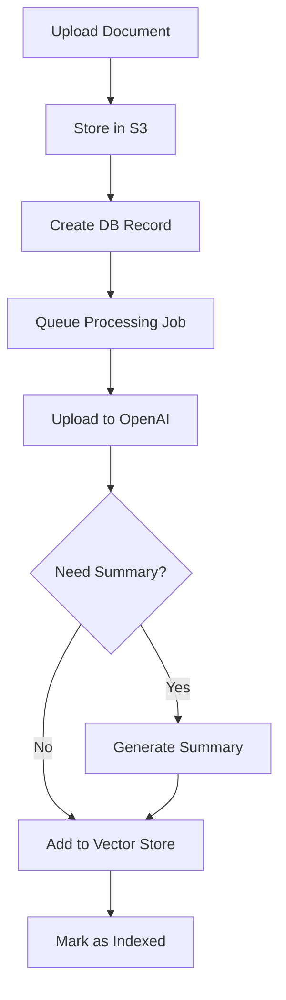

# Document Storage & Processing Architecture

## Overview

The document storage system is designed to support a "virtual law firm" platform that helps pro se litigants manage their legal cases. The system provides secure document storage, AI-powered analysis, and collaborative access to case materials.

## Core Components

### 1. Storage Infrastructure

#### Physical Storage (S3)
- Documents are stored in Linode Object Storage (S3-compatible)
- Configured with lifecycle rules for temporary file cleanup
- Access controlled via AWS credentials in environment configuration

#### Database Schema

**Case Files Table**
```sql
CREATE TABLE case_files (
    id BIGINT PRIMARY KEY,
    user_id BIGINT,
    title VARCHAR(255),
    case_number VARCHAR(255),
    desired_outcome TEXT,
    status VARCHAR(255),
    openai_assistant_id VARCHAR(255),
    openai_vector_store_id VARCHAR(255),
    openai_project_id BIGINT,
    created_at TIMESTAMP,
    updated_at TIMESTAMP
);
```

**Documents Table**
```sql
CREATE TABLE documents (
    id BIGINT PRIMARY KEY,
    case_file_id BIGINT,
    storage_path VARCHAR(255),
    original_filename VARCHAR(255),
    mime_type VARCHAR(255),
    file_size BIGINT,
    title VARCHAR(255),
    description TEXT,
    openai_file_id VARCHAR(255),
    ingestion_status ENUM('pending', 'uploading', 'summarizing', 'indexing', 'indexed', 'failed'),
    ingestion_error TEXT,
    ingested_at TIMESTAMP,
    created_at TIMESTAMP,
    updated_at TIMESTAMP
);
```

### 2. AI Integration Components

#### OpenAI Projects
- Manages API keys and usage across multiple OpenAI accounts
- Tracks storage usage and active status
- Allows load balancing across multiple API keys

#### Case Assistants
- Dedicated GPT-4 powered assistant for each case
- Maintains context awareness through vector store integration
- Provides document drafting and analysis capabilities

#### Vector Stores
- Enables semantic search across case documents
- Maintains document embeddings for quick retrieval
- Integrated with OpenAI's retrieval system

## Document Processing Flow

### 1. Upload Process
1. User uploads document through web interface
2. File is stored in S3
3. Document record created in database
4. ProcessDocumentJob queued for async processing

### 2. Processing Pipeline


### 3. Status Tracking
Documents progress through multiple states:
- `pending`: Initial state after upload
- `uploading`: Being uploaded to OpenAI
- `summarizing`: AI generating title/description
- `indexing`: Being added to vector store
- `indexed`: Successfully processed
- `failed`: Processing error occurred

## Error Handling

### Retry Mechanism
- Processing jobs have 3 retry attempts
- Backoff periods: 30s, 60s, 120s
- 10-minute timeout per attempt

### Error Logging
- Detailed error logging with document ID
- Ingestion errors stored in document record
- System-level errors logged via Laravel's logging system

## Security Considerations

### Access Control
- Documents accessible only to users associated with the case
- S3 access controlled via IAM policies
- No direct public access to stored files

### Data Protection
- Files stored in private S3 buckets
- Database credentials secured via environment configuration
- OpenAI API keys managed through secure project system

## Integration Points

### OpenAI Services
- File upload API for document processing
- Chat API for summary generation
- Vector store API for semantic search
- Assistants API for case management

### Storage Services
- S3-compatible object storage
- Lifecycle management for temporary files
- Backup and retention policies

## Monitoring & Maintenance

### Key Metrics
- Document processing success rate
- Processing time per document
- Storage usage per case
- API usage per OpenAI project

### Maintenance Tasks
- Regular cleanup of temporary files
- Monitoring of failed processing jobs
- Storage usage optimization
- API key rotation and management

## Future Considerations

### Scalability
- Horizontal scaling of processing workers
- Multiple OpenAI projects for load distribution
- Sharding strategies for large case files

### Feature Expansion
- Additional document types support
- Enhanced document analysis capabilities
- Improved collaboration features
- Advanced security features